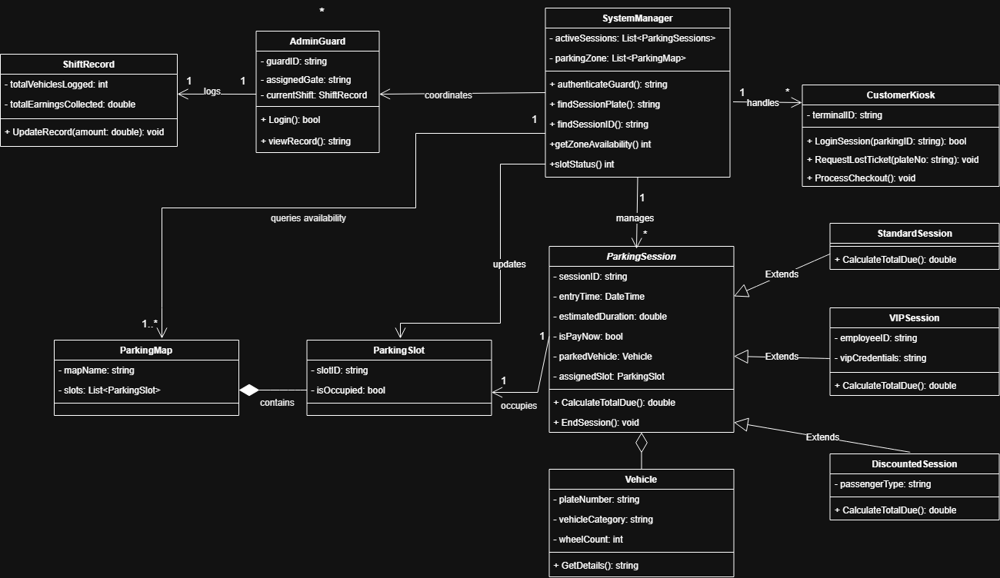

<div align="center">

<H1><strong> RESERBA </strong></H1>
<BR><strong>Your Real - Time Entry System for Efficient Routing, Billing, and Access</strong> 
<BR><strong>Mapping your way to the perfect spot</strong><BR>

<BR> **CS 2203** <BR>
**Asilo, Sofhia Aubrey M.** <BR>
**Doria, John Vincent M.** <BR>
**Palicpic, Nicko S.** <BR>
**Salem, Jillian Ayesa T.** <BR>

</div>

## ☑️ | Overview
<div align = "justify">
<strong>RESERBA</strong> is a centralized parking management system that streamlines operations to enhance facility performance while removing the challenging process of parking space search that involves unpredictable space location. The parking facility staff uses the real-time admin dashboard to obtain complete structural information about available parking spaces throughout the entire building. The centralized system enables parking facilitators to provide vehicle parking assignments immediately when cars arrive at entry points. The drivers receive precise parking information which helps them park their vehicles before they enter the building, thus reducing internal traffic flow while providing an efficient parking system that starts from the entrance point.
</div>

## 🎯 | Purpose
<div align = "justify">
The main goal of <strong>RESERBA</strong> is to completely eliminate the hassle of searching for an open parking spot by immediately directing drivers where to go. Instead of having cars drive around aimlessly, the system assigns a specific parking space right as a vehicle enters, which really helps reduce congestion and keeps the entrance line moving. It pulls this off using a real-time visual map that shows facilitators exactly which spots are open in green and which are taken in red. Plus, to make leaving just as easy, it includes a vehicle locator tool that pinpoints the car's exact slot, saving drivers the stress of trying to remember where they parked in a large facility.
</div>

## 🗺️ | UML Diagram

<td> </td>

## 📊 | ERD Diagram

## ➰ | Features
<div align = "justify">
1. <strong>
2. <strong>
3. <strong>
4. <strong>
5. <strong>
</div>

## 🧩 | Project Structure
```
📂 src/
└── 📂 RESERBA/
    ├── #️⃣ Main.cs         
    ├── #️⃣ Core.cs
    └── #️⃣ Person.cs
    └── 📂 Core/
    |   ├── #️⃣ Console.cs
    |   ├── #️⃣ Game.cs
    |   ├── #️⃣ Graphics.cs
    └── 📂 Person/
        ├── #️⃣ GamesOfClubs.cs
        ├── #️⃣ GameOfDiamonds.cs
        ├── #️⃣ GameOfHearts.cs
        └──  #️⃣ GameOfSpades.cs
```
- `RESERBA` - The main package for the simulation.
-  `Main.cs` - Contains the entry point and game loop logic.
-  `Player` - Handles player attributes, survival status, and inventory.

## ⚙️ | How The Program Works

## 🏃‍♀️ | How To Run The Program
Open your terminal in the `src/` folder and run:
```
csc ProjectAyesa/main/*.cs
```
Run the program using:
```
Main.exe
```

## ✅ | Sample Output
```
```

## 💻 | Object - Oriented Principles
### 🎁 Encapsulation
<div align = "justify">
</div>

### 🧬 Inheritance
<div align = "justify">
</div>

### 🪄 Abstraction
<div align = "justify">
</div>

### 🎭 Polymorphism
<div align = "justify">
</div>

## ✨ | Future Enhancements
<div align = "justify">
</div>

## 🤝 | Contributors
<table>
<tr>
    <th> &nbsp; </th>
    <th> Name </th>
    <th> Role </th>
</tr>
 <tr>
    <td> </td>
    <td><strong>Sofhia Aubrey M. Asilo</strong> <br/>
    <a href="https://github.com/asilo-sofhia" target="_blank">
    
        </a>
    </td>
    <td><strong>UI / UX</strong></td>
</tr>
<tr>
    <td> </td>
    <td><strong>John Vincent M. Doria</strong> <br/>
    <a href="https://github.com/JVinceent" target="_blank">
    
        </a>
    </td>
    <td><strong>Backend Developer</strong></td>
</tr>
<tr>
    <td> </td>
    <td><strong>Nicko S. Palicpic</strong> <br/>
    <a href="https://github.com/nickopalicpic" target="_blank">
    
        </a>
    </td>
    <td><strong>QA Tester</strong></td>
</tr>
<tr>
    <td> </td>
    <td><strong>Jillian Ayesa T. Salem</strong> <br/>
    <a href="https://github.com/Jillian-Ayesa" target="_blank">
    
        </a>
    </td>
    <td><strong>Project Manager</strong></td>
</tr>
</table>

## 📚 | References
<div align = "justify">
</div>

 
### 🫂 | Acknowledgment
<div align = "justify">
We truly thank our instructor for all of the help and support we received in finishing this project.  We also thank our peers and classmates for their support and cooperation during the developing process.
</div>
