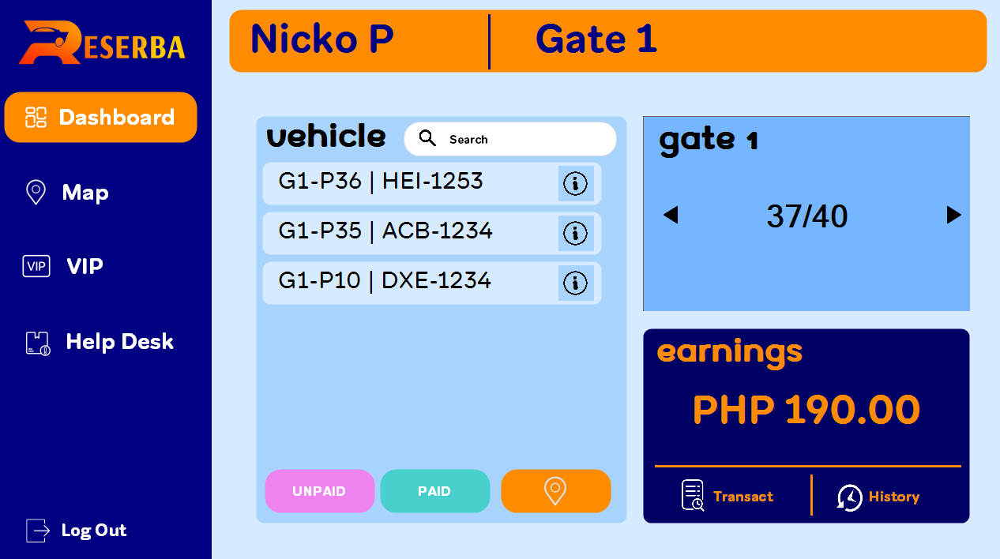
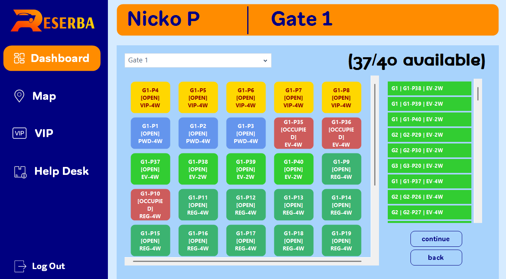
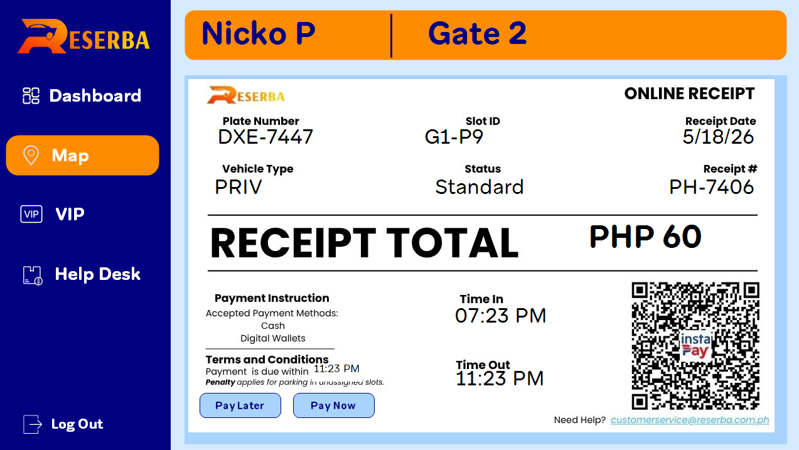

<div align="center">


<BR>
<BR>

**Your Real-Time Entry System for Efficient Routing, Billing, and Access**

*Mapping your way to the perfect spot*


**CS 2203** <BR>
**Asilo, Sofhia Aubrey M.** <BR>
**Doria, John Vincent M.** <BR>
**Palicpic, Nicko S.** <BR>
**Salem, Jillian Ayesa T.** <BR>

</div>

<div align="center">

</div>

---

## ☑️ Overview

**RESERBA** is a centralized parking management system that streamlines operations to enhance facility performance while eliminating the stressful search for an available parking space. The parking facility staff uses a real-time admin dashboard to obtain complete visibility of available parking spaces throughout the entire building. The centralized system enables parking facilitators to assign vehicle parking slots immediately when cars arrive at entry points — so drivers receive precise parking directions before they even enter the building, reducing internal traffic and delivering an efficient experience from the very first moment.

---

## 🎯 Purpose

The main goal of **RESERBA** is to completely eliminate the hassle of searching for an open parking spot by directing drivers exactly where to go the moment they arrive. Instead of cars circling aimlessly, the system assigns a specific parking space right at entry — reducing congestion and keeping entrance lines moving. This is achieved through a real-time visual map that shows facilitators which spots are open (green) and which are occupied (red). To make leaving just as smooth, a vehicle locator tool pinpoints a car's exact assigned slot, saving drivers the frustration of forgetting where they parked in a large facility.

---

## 🗺️ UML Diagram
<div align="center">

</div>


---

## ➰ Features

### 👤 User Interface
Real-time parking slot locator that shows the user's current position (e.g., `G2-P12`) with clear status indicators — **Occupied** / **Vacant** — and quick action buttons for payment or transaction cancellation.

### 📊 Admin Dashboard
Comprehensive overview of vehicle details, gate status, slot availability, and earnings. Features quick access to unpaid/paid transactions and real-time gate monitoring with auto-refresh every few seconds.

### 📍 Parking Map
Interactive parking map with color-coded slot status (Open / Occupied) and vehicle type information. Allows staff to easily browse and select available spaces across all gates, filtered by vehicle and passenger category.

### 💰 Payment
Seamless payment interface with digital receipt generation. Displays plate number, slot ID, vehicle type, parking duration, and total amount due — with support for multiple payment methods and a QR code for instant payment.

### ⏳ Estimated Duration
User-friendly duration selection where drivers choose their intended parking length. Automatically calculates the estimated time of departure and confirms slot reservation details before proceeding to payment.

---

## 🧩 Project Structure

```
📂 RESERBA/
├── #️⃣ Program.cs                  ← Application entry point
├── #️⃣ SessionContext.cs           ← Global session state across screens
├── 🖼️ pictureBox1.Image.jpg
├── 🖼️ PictureBox2.Image.png
│
├── 📂 Controls/                   ← Reusable custom UserControls
│   ├── #️⃣ SlotButton.cs
│   ├── #️⃣ SlotButtonG2.cs
│   ├── #️⃣ SlotButtonG3.cs
│   ├── #️⃣ EstimatedDuration.cs
│   └── #️⃣ EstimatedDetails.cs
│
├── 📂 Database/                   ← Database access layer
│   └── #️⃣ DatabaseHelper.cs
│   └── #️⃣ IGuardRepository.cs     ← Interface
│   └── #️⃣ GuardRepository.cs
│
├── 📂 Fonts/                      ← Custom fonts bundled with app
│   ├── 🔤 Rounded.ttf
│   ├── 🔤 AribauRoundedTrial-Regular.otf
│   └── 🔤 AribauRoundedTrial-Bold.otf
│
├── 📂 Helpers/                    ← Utility classes
│   └── #️⃣ FontManager.cs
│
├── 📂 Models/                     ← OOP data models
│   ├── #️⃣ ParkingSession.cs      ← Abstract base class
│   ├── #️⃣ StandardSession.cs
│   ├── #️⃣ DiscountedSession.cs
│   ├── #️⃣ ValetSession.cs
│   └── #️⃣ Vehicle.cs
│
├── 📂 Properties/
│   ├── #️⃣ Resources.Designer.cs
│   ├── 📄 Resources.resx
│   └── 📂 PublishProfiles/
│
├── 📂 Videos/
│   └── 🎬 RESERBA.mp4
│
└── 📂 Forms/                      ← All application screens
    ├── 📂 Startup/
    │   ├── #️⃣ AAAStart.cs        (Splash / Login)
    │   ├── #️⃣ AABStart.cs        (Guard Login)
    │   └── #️⃣ AACStart.cs        (Gate Selection)
    │
    ├── 📂 Admin/
    │   ├── #️⃣ AAdmin1.cs
    │   ├── #️⃣ AAdmin2.cs
    │   ├── #️⃣ AAdmin3.cs
    │   ├── #️⃣ ADashboard.cs
    │   └── #️⃣ ABDashboard.cs     (Real-time Admin Dashboard)
    │
    ├── 📂 User/
    │   ├── #️⃣ AB_User1.cs
    │   ├── #️⃣ AB_User2.cs
    │   ├── #️⃣ AB_User4.cs        (Vehicle Info Entry)
    │   ├── #️⃣ AB_User5.cs
    │   ├── #️⃣ AB_User6.cs
    │   └── #️⃣ Information.cs
    │
    ├── 📂 Map/
    │   ├── #️⃣ BAMap.cs            (Gate 1 Map)
    │   ├── #️⃣ BBMap.cs            (Gate 2 Map — interactive slot selector)
    │   ├── #️⃣ BCMap.cs            (Gate 3 Map)
    │   ├── #️⃣ BDMaps.cs
    │   └── #️⃣ DAVIP.cs            (VIP Map)
    │
    └── 📂 Payment/
        ├── #️⃣ EAPayment.cs
        ├── #️⃣ EAPaymentLater.cs
        ├── #️⃣ EAPaymentNowA.cs
        ├── #️⃣ EAPaymentNowB.cs
        ├── #️⃣ EAPaymentNowVIPA.cs
        └── #️⃣ EAPaymentNowVIPB.cs
```

### Key Files

| File | Purpose |
|---|---|
| `Program.cs` | Application entry point; launches the main window |
| `SessionContext.cs` | Static class holding all active session data (plate number, gate, slot, passenger type, estimated duration) shared across screens |
| `DatabaseHelper.cs` | Single point of access to the MySQL connection via Aiven Cloud |
| `FontManager.cs` | Loads and registers custom fonts at runtime |
| `Models/` | All OOP model classes — see OOP Principles section below |
| `SlotButton*.cs` | Custom `UserControl` components displaying per-gate live slot counts fetched from the database |
| `EstimatedDuration.cs` | `UserControl` for duration selection and departure time calculation |

---

## ⚙️ How The Program Works

```
Vehicle Arrives
      │
      ▼
1. Guard Login ──────── Guard logs in → gate assigned → stored in SessionContext
      │
      ▼
2. Vehicle Entry ─────── Plate number, vehicle type, passenger category entered
      │
      ▼
3. Slot Assignment ───── Interactive map loads gate slots (green = open, red = taken)
      │                   Filtered by vehicle type and passenger category
      ▼
4. Duration Selection ── Guard selects intended parking duration
      │                   System calculates estimated time-out → saved to DB
      ▼
5. Payment ──────────── Billing generated via StandardSession / DiscountedSession / ValetSession
      │                   Driver pays now (receipt + QR) or pays later at exit
      ▼
6. Dashboard ────────── Admin monitors earnings, slot counts, and live session list in real time
```

---

## 🏃‍♀️ | How To Run The Program

### Prerequisites
- Visual Studio 2022 or later
- .NET 10.0 Windows SDK

### Steps

1. Clone the repository
   ```bash
   git clone https://github.com/Jillian-Ayesa/RESERBA.git
   ```

2. Open `RESERBA Proj.csproj` in Visual Studio
3. Update the database password in `Database/DatabaseHelper.cs` (see Setup Instructions below)
4. Press `F5` or click **Start** to run

   
---

## ⚙️ | Setup Instructions

### Database Configuration
This project connects to a MySQL database hosted on Aiven Cloud.

After cloning the repository:

1. Open `RESERBA Proj/Database/DatabaseHelper.cs`
2. Go to **line 12**
3. Replace `Pwd=RESERBAFinal` with the actual password
4. Contact the project owner for the actual password

---

## ✅ Sample Output

<div align="center">
  
  <br>
  <em>Figure 1: The main dashboard interface showing real-time slot allocation.</em>
</div>

<br><br> <div align="center">
  
  <br>
  <em>Figure 2: Parking slot layout and availability status.</em>
</div>

<br><br>

<div align="center">
  
  <br>
  <em>Figure 3: Automated digital receipt and billing interface.</em>
</div>

---

## 💻 Object-Oriented Principles

### 🎁 Encapsulation
Encapsulation is applied throughout the `Models` layer. In `Vehicle.cs`, all properties (`PlateNumber`, `VehicleType`, `PassengerType`, `WheelCount`) are declared with `private set`, meaning they can only be assigned through the constructor and cannot be modified externally. `ParkingSession` uses `protected set` so only the class and its subclasses can change values. `DatabaseHelper` also demonstrates encapsulation by hiding the raw connection string behind a static `GetConnection()` method — the rest of the application never needs to know the server address, port, or credentials.

### 🧬 Inheritance
`Models/` is built on a clear inheritance hierarchy. `ParkingSession` is the abstract base class defining the shared structure of all sessions: session ID, plate number, gate, slot, entry time, and payment status. `StandardSession` and `ValetSession` both extend it and provide their own billing logic. `DiscountedSession` goes one level deeper — it extends `StandardSession` and adds a passenger type and discount percentage, reusing the standard rate calculation and applying a deduction on top. PWD and Student discounts are handled automatically without duplicating any billing code.

### 🪄 Abstraction
`ParkingSession` defines two abstract methods — `CalculateTotalDue(DateTime exitTime)` and `ProcessCheckOut(DateTime exitTime)` — without implementing them. This forces every session type to supply its own billing logic while the rest of the system calls these methods through a shared interface, without knowing which session type is active. `DatabaseHelper` also acts as an abstraction layer: every form calls `DatabaseHelper.GetConnection()` without being aware of the underlying MySQL configuration.

### 🎭 Polymorphism
Polymorphism is demonstrated through method overriding of `CalculateTotalDue` across all three session types:

| Session Type | Billing Logic |
|---|---|
| `StandardSession` | Flat base rate for first 3 hours, then hourly charge beyond that |
| `ValetSession` | Flat fee of PHP 200, plus PHP 800/day surcharge for overnight stays |
| `DiscountedSession` | Calls `base.CalculateTotalDue()` then applies a percentage deduction |

The payment screen calls `session.CalculateTotalDue(exitTime)` on any session object and gets the correct amount automatically — no type-checking required.

---

## ✨ Future Enhancements

| Enhancement | Description |
|---|---|
| 📱 Mobile Companion App | Lightweight interface for drivers to view their assigned slot and estimated fees |
| 🚗 Automated Exit Verification | Gate sensor or license plate recognition integration to auto-mark sessions as exited |
| 📈 Advanced Analytics | Charts and exportable reports for peak hours, revenue trends, and slot utilization |
| 🔖 Online Pre-Booking | Allow drivers to reserve a slot before arriving, reducing entry queue congestion |
| 🏢 Multi-Building Support | Manage multiple parking facilities under one admin account |
| 🔔 Push Notifications | Alert guards when a driver's estimated time-out is approaching or payment is overdue |

---

## 🤝 Contributors

<table>
<tr>
    <th>&nbsp;</th>
    <th>Name</th>
    <th>Role</th>
</tr>
<tr>
    <td></td>
    <td>
        <strong>Sofhia Aubrey M. Asilo</strong><br/>
        <a href="https://github.com/asilo-sofhia">
        
        </a>
    </td>
    <td>UI / UX Designer</td>
</tr>
<tr>
    <td></td>
    <td>
        <strong>John Vincent M. Doria</strong><br/>
        <a href="https://github.com/JVinceent">
        
        </a>
    </td>
    <td>Backend Developer</td>
</tr>
<tr>
    <td></td>
    <td>
        <strong>Nicko S. Palicpic</strong><br/>
        <a href="https://github.com/nickopalicpic">
        
        </a>
    </td>
    <td>QA Tester</td>
</tr>
<tr>
    <td></td>
    <td>
        <strong>Jillian Ayesa T. Salem</strong><br/>
        <a href="https://github.com/Jillian-Ayesa">
        
        </a>
    </td>
    <td>Project Manager</td>
</tr>
</table>

---

## 📚 References

- Microsoft. (2024). *C# documentation*. https://learn.microsoft.com/en-us/dotnet/csharp/
- Oracle. (2024). *MySQL 8.0 reference manual*. https://dev.mysql.com/doc/refman/8.0/en/
- Aiven. (2024). *Aiven for MySQL documentation*. https://aiven.io/docs/products/mysql
- MySql.Data NuGet Package. (2024). *MySql.Data connector/NET*. https://www.nuget.org/packages/MySql.Data
- Guna UI2 Framework. (2024). *Guna UI 2 WinForms*. https://gunaui.com/

---

## 🫂 Acknowledgment

We sincerely thank our instructor for the guidance and support provided throughout this project. We also extend our gratitude to our peers and classmates for their cooperation and encouragement during the development process.

---

<div align="center">
<sub>RESERBA © 2026 · CS 2203 · Batangas State University — The National Engineering University</sub>
</div>


